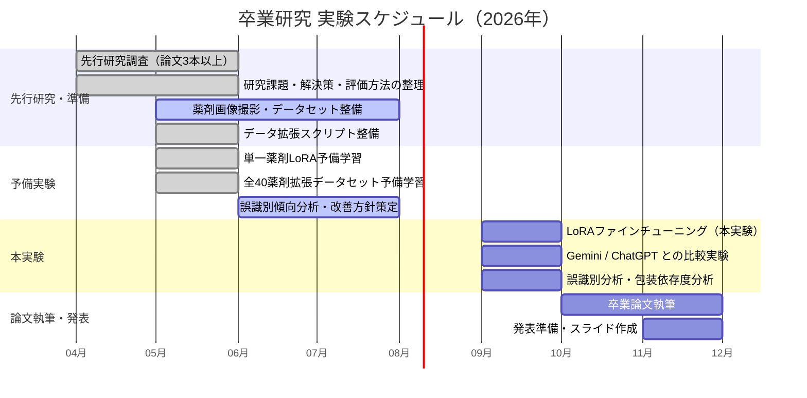

# マルチモーダル学習による薬剤鑑別 — 進捗管理

## 研究テーマ

**マルチモーダル学習による薬剤鑑別**

| 項目         | 内容                                                                                                                                                                                 |
| ------------ | ------------------------------------------------------------------------------------------------------------------------------------------------------------------------------------ |
| **課題**     | 薬剤名が記載された外箱・薬袋が失われた場合に，錠剤・PTPシートの外観のみから薬剤を識別する必要がある．従来手法は複数の専用モジュールを要するか，商用APIに依存しプライバシー懸念がある |
| **解決策**   | オープンソースVLM（Qwen3.5-4B）を少数の実画像（4〜8枚/薬剤）＋データ拡張（11種類）でLoRAファインチューニングし，単一モデルで薬剤鑑別を実現する                                       |
| **評価方法** | Top-1 Accuracy（学習・評価データを分離）でGemini/ChatGPTゼロショットと比較する                                                                                                       |

## 解決策の妥当性検討

| 観点                   | 検討内容                                                 | 結論                                         |
| ---------------------- | -------------------------------------------------------- | -------------------------------------------- |
| 少数画像でのLoRA有効性 | 1薬剤6枚→拡張66枚で学習したメインテート錠が評価22/22正答 | 予備実験で確認済み ✓                         |
| 多クラス拡張性         | 40薬剤2343枚で学習し評価814枚中799枚正答（98.2%）        | 予備実験で確認済み ✓                         |
| Geminiとの精度比較     | 単一薬剤でLoRA 100% vs Gemini 0%（無料枠制約あり）       | 有料プランでの再評価が必要 △                 |
| 回転への頑健性         | ±30度回転・水平反転で誤識別集中（15枚中14枚）            | 学習時の回転拡張強化または前処理で対応予定 △ |
| プライバシー           | オープンソースモデルをローカル実行                       | 外部送信なし ✓                               |

## 実験計画（ガントチャート）

## フェーズ別タスク一覧

| フェーズ           | 期間   | タスク                                       | 状況   |
| ------------------ | ------ | -------------------------------------------- | ------ |
| **先行研究・準備** | 4〜7月 | 先行研究調査（論文3本以上）                  | 完了 ✓ |
|                    |        | 研究課題・解決策・評価方法の整理             | 完了 ✓ |
|                    |        | 薬剤画像撮影・データセット整備               | 進行中 |
|                    |        | データ拡張スクリプト整備                     | 完了 ✓ |
| **予備実験**       | 5〜8月 | 単一薬剤LoRA予備学習（メインテート錠，100%） | 完了 ✓ |
|                    |        | 全40薬剤拡張データセット予備学習（98.2%）    | 完了 ✓ |
|                    |        | 誤識別傾向分析・回転頑健性の改善方針策定     | 進行中 |
| **本実験**         | 9月    | LoRAファインチューニング（本実験）           | 未着手 |
|                    |        | Gemini / ChatGPT との比較実験                | 未着手 |
|                    |        | 誤識別分析・包装依存度分析                   | 未着手 |
| **論文執筆・発表** | 10月〜 | 卒業論文執筆                                 | 未着手 |
|                    |        | 発表準備・スライド作成                       | 未着手 |
